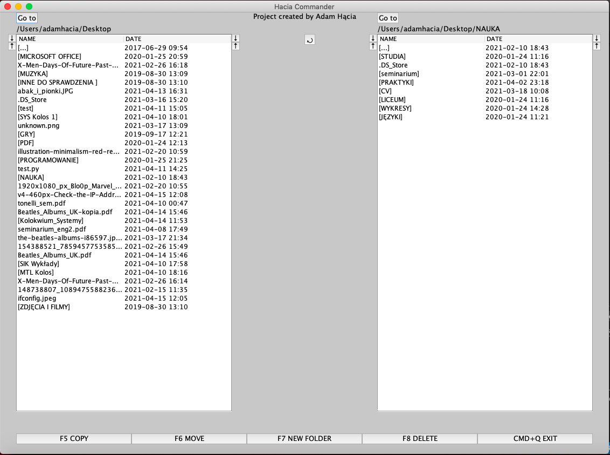
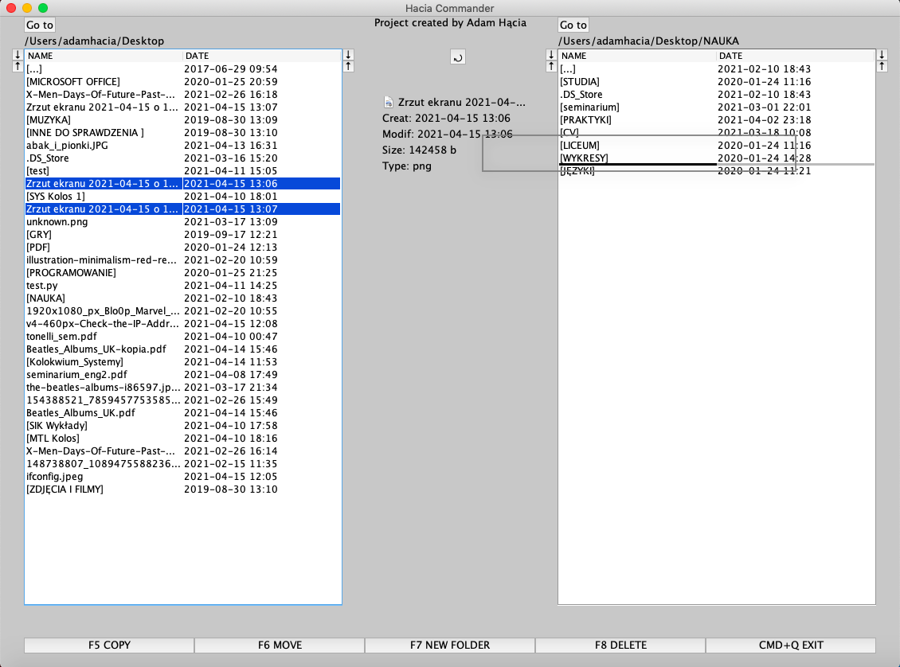
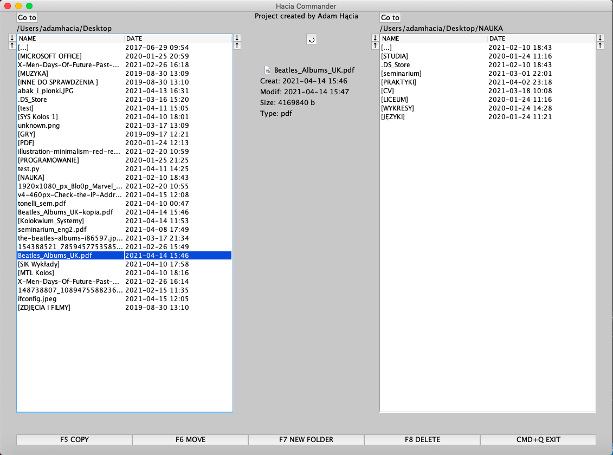
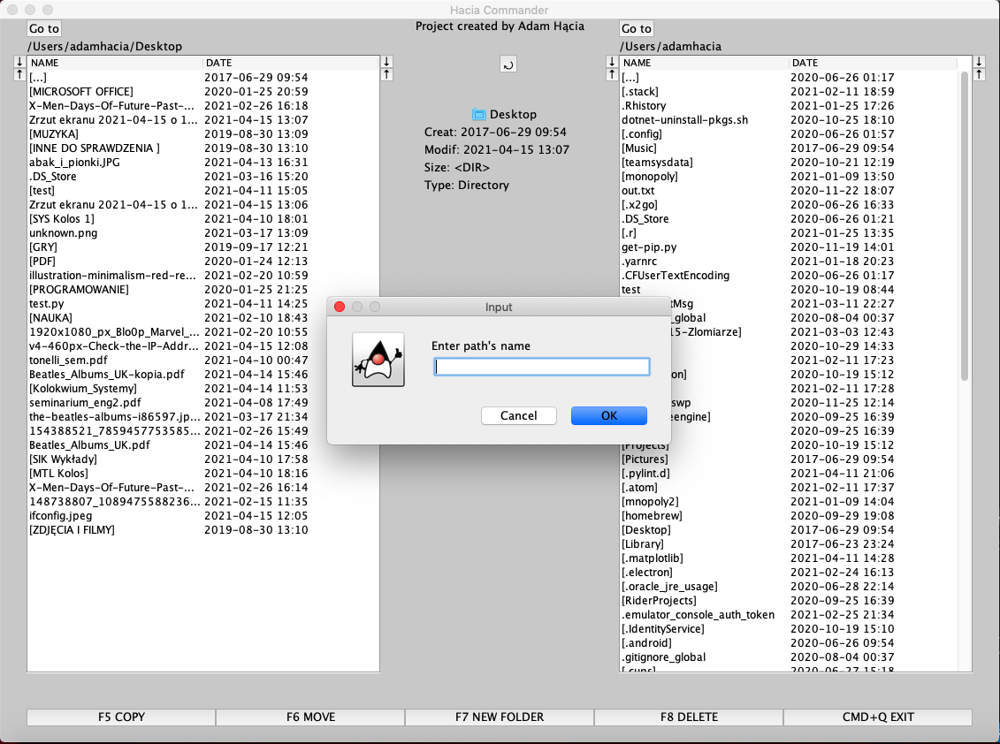
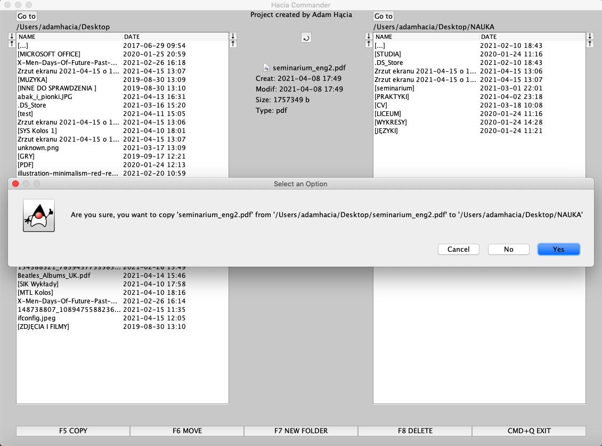

# Hacia Total Commander
> Simple file manager, similar to [Total Commander](https://www.ghisler.com/). Program works on MacOs, Linux and Windows system.

## Table of contents
- [Hacia Total Commander](#hacia-total-commander)
  - [Table of contents](#table-of-contents)
  - [Screenshots](#screenshots)
  - [Technologies](#technologies)
  - [Setup](#setup)
  - [Features](#features)
  - [Status](#status)
  - [Inspiration](#inspiration)
  - [Contact](#contact)

## Screenshots



Drag & Drop option



Info of a file



Select path



Several option (Copy, Move, New Folder, Delete)



## Technologies
* Java 
* Swing

## Setup
Run ```TotalCommander.java```

## Features
* Moving into subfolder and parent folders like in Total Commander
* Sorting files/folders by name or creation date
* Copying files/folders using drag and drop
* Copying files/folders (button F5)
* Moving files/folders (button F6)
* Creating new folders (button F7)
* Deleting files/folders (button F8)
* Files/folders info
* Selecting specific path
* Open some files by double clicking on them eg. ```jpg, png, txt ``` and more

## Status
Project is: _completed_

## Inspiration
I really love Total Commander, it's perfect file manager, so I wanted to create similar app and learn how to create desktop app in Java.

## Contact
Created by [@HondaPL](https://hacia.students.wmi.amu.edu.pl/) 2020

